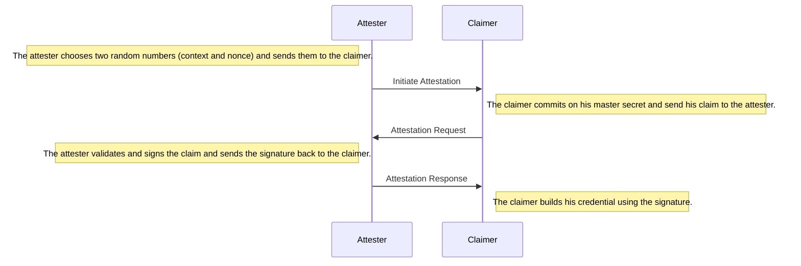

# Attestation

During the attestation the attester signs a claim, sends the signature over to the claimer who then builds his credential using the claim and the signature.



Before an attester can create attestations, she has to generate a key pair and publish her public key.

```ts
// Build a new attester.
// Generating a new key pair will take around 10-30 minutes.
const attester = GabiAttester.buildFromScratch()
// create a new accumulator (which is used for revocation)
let update = await gabiAttester.createAccumulator()

// Build a new claimer and generate a new master key.
const claimer = GabiAttester.buildNewClaimer()
```

After the attester and claimer have both generated their keys, the attestation session can be initiated by the attester.

```ts
// The attester initiates the attestation session:
const {
    // The message should be send over to the claimer.
    startAttestationMsg,
    // The session stores local session information for the attester.
    attesterSession,
} = await attester.startAttestation()

// the claimer answers with an attestation request
const claim = {
    age: 15,
    name: "George",
}

const {
    // The message should be send over to the attester.
    attestation: attestationRequest,
    // The session stores information for the claimer.
    session: claimerSession,
} = await claimer.requestAttestation({
    // The received attestation message
    startAttestationMsg,
    // The claim which should get attested.
    claim,
    // The public key of the attester.
    attesterPubKey: attester.getPubKey(),
})

// The attester should check the claim he is about to attest.
const checkClaim = attestationRequest.getClaim()
// if everything checks out the attest issues an attestation.
const {
    // the attestation should be send over to the claimer.
    attestation,
    // the witness should be stored for later revocation.
    witness
} = await attester.issueAttestation({
    attestationSession,
    attestationRequest,
    // The update is used to generate a non revocation witness
    update,
})

// After the claimer has received his attestation he can build his credential
const credential = await claimer.buildCredential({
    claimerSession,
    attestation,
})
```

After the attestation session has finished the attester has a witness which can be used to revoke the attestation and the claimer received a credential with which he can generate presentations for a validator.
