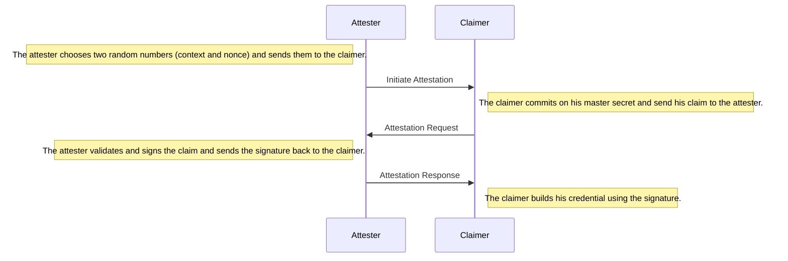

# Attestation

During the attestation, the attester first signs a claim.
Then, she sends the signature over to the claimer who builds his credential using the claim and the signature.



Before an attester can create attestations, she has to generate a key pair and publish her public key.

```ts
const portablegabi = require("@KILTprotocol/portablegabi")
// build a new attester
// note: generating a new key pair will take around 10-30 minutes
// const attester = await portablegabi.Attester.create(365, 70)


// for this example you could use the provided keys
// note: never use those keys in production!!!
const attester = new portablegabi.Attester(pubKey, privKey)

// create a new accumulator (which is used for revocation)
let accumulator = await attester.createAccumulator()
console.log("Accumulator: ", accumulator.valueOf())

// build a new claimer and generate a new master key
// const claimer = await portablegabi.Claimer.create()
// or use a mnemonic for:
const claimer = await portablegabi.Claimer.buildFromMnemonic('siege decrease quantum control snap ride position strategy fire point airport include')
```

After the attester and claimer have both generated their keys, the attestation session can be initiated by the attester.

```js
// the attester initiates the attestation session
const {
    message: startAttestationMsg,
    session: attestationSession,
} = await attester.startAttestation()

// the claimer answers with an attestation request
const claim = {
    age: 15,
    name: "George",
}

const {
    message: attestationRequest,
    session: claimerSession,
} = await claimer.requestAttestation({
    // the received attestation message
    startAttestationMsg,
    // the claim which should get attested.
    claim,
    // the public key of the attester.
    attesterPubKey: attester.publicKey,
})

// the attester should check the claim she is about to attest
const receivedClaim = attestationRequest.getClaim()

// do checks on receivedClaim
// if everything checks out the attester issues an attestation
const {
    // the attestation should be sent over to the claimer
    attestation,
    // the witness should be stored for later revocation
    witness
} = await attester.issueAttestation({
    attestationSession,
    attestationRequest,
    // the update is used to generate a non-revocation witness
    accumulator,
})
console.log("Witness: ", witness.valueOf())

// after the claimer has received his attestation, he can build his credential
const credential = await claimer.buildCredential({
    claimerSession,
    attestation,
})
console.log("Credential: ", credential.valueOf())
```

Upon completion of an attestation session, the attester receives a witness which can be used to revoke the attestation and the claimer receives a credential with which he can generate presentations for an arbitrary amount of verifiers.
