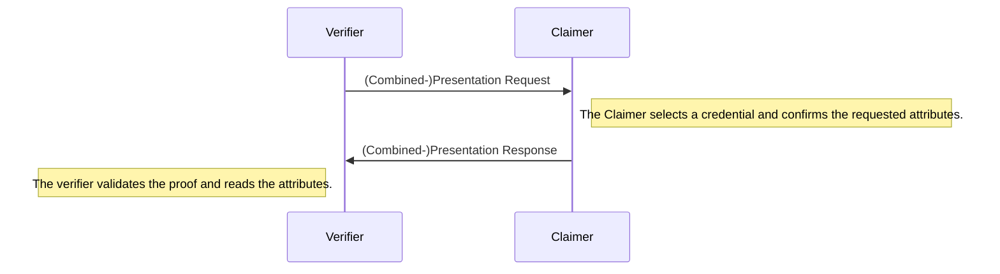

# Verification

During the verification the verifier request a set of attributes from the claimer. 
The claimer discloses his attributes and provides a proof.
the verifier can validate that the attributes are singed by a trusted attester using the proof.



The claimer needs a credential and the public key of the attester who signed the credential.
The verifier needs to trust the attester who signed the credential and the latest accumulator of the specific attester.

```ts
const portablegabi = require("@KILTprotocol/portablegabi")

const claimer = await portablegabi.GabiClaimer.buildFromMnemonic('siege decrease quantum control snap ride position strategy fire point airport include')

const credential = new portablegabi.Credential('<The credential created during the attestation>')
const accumulator = new portablegabi.Accumulator('<The accumulator created during the attestation>')
const pubKey = new portablegabi.AttesterPublicKey('<Public key of the attester>')

// The verifier request a presentation:
const {
    // local information used to verify the presentation later
    session: verifierSession,
    // the request which should be send to the claimer and contains the requested attributes
    message: presentationReq,
} = await portablegabi.GabiVerifier.requestPresentation({
    // specify which attributes should be disclosed
    requestedAttributes: ["age"],
    // The threshold for the age of the accumulator. If the accumulator was created before this date
    // the proof will be rejected. Except if the accumulator is the newest available accumulator.
    reqUpdatedAfter: new Date(),
})

// After the claimer has received the PresentationRequest he builds a Presentation:
const presentation = await claimer.buildPresentation({
    credential,
    presentationReq,
    attesterPubKey: pubKey,
})

// The presentation is send over to the verifier who validates the proof and extracts the claim
const {
    // the contained claim, this value is undefined if the proof could not be validated.
    claim,
    // a boolean which indicates whether the presentation was valid.
    verified,
} = await portablegabi.GabiVerifier.verifyPresentation({
    // the presentation which was send over by the claimer
    proof: presentation,
    verifierSession,
    // the public key which was used by the attester to sign the credential
    attesterPubKey: pubKey,
    // This accumulator is used to check whether the claimer provided the newest available accumulator.
    latestAccumulator: accumulator,
})
console.log('Claim: ', claim)
console.log('Verified? ', verified)
```
