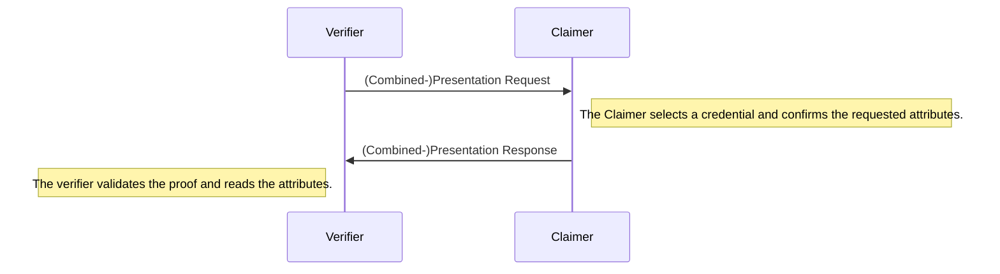

# Verification

During the verification, the verifier requests a set of attributes from the claimer. 
The claimer discloses his attributes and provides a proof (referred to as presentation).
The verifier can then validate that the attributes are signed by a trusted attester using the claimer's presentation.



The claimer is required to have both a credential and the public key of the attester who signed it.
On the other hand, the verifier needs to trust the attester who signed the credential and her latest accumulator. 

Actually, any accumulator of the attester would work but the it could be possible that the credential has been revoked recently. 
Therefore, verifiers are incentivized to use the latest version. 

### Timestamps

However, new versions of accumulators could be added to the chain in between the request, presentation and verification of the proof. 
Thus, a verifier has to commit to some *minimum timestamp* of the credential, which he can require as `reqUpdatedAfter` when requesting a presentation. 
The credential then potentially needs to be updated with `.update` before the claimer can build the presentation in `buildPresentation`. An error will be thrown in `buildPresentation` when the claimer's credential's timestamp is lower than the requested one.

Obviously, a verifier should rather commit to a specific accumulator instead of a timestamp. However, since the verifier starts a verification session, he does (and also should) not know who attested the credential(s) which are about to be presented by the claimer.

## Example

```ts
const portablegabi = require("@KILTprotocol/portablegabi")

const claimer = await portablegabi.Claimer.buildFromMnemonic('siege decrease quantum control snap ride position strategy fire point airport include')

const credential = new portablegabi.Credential('<The credential created during the attestation>')
const accumulator = new portablegabi.Accumulator('<The accumulator created during the attestation>')
const pubKey = new portablegabi.AttesterPublicKey('<Public key of the attester>')

// get the accumulator's timestamp to be used in requestPresentation
// note: in the real world, the verifier could not know the exact timestamp as the attester is unknown to the verifier
const accumulatorTimestamp = await accumulator.getDate(pubKey)

// the verifier request a presentation
const {
    // local information used to verify the presentation later
    session: verifierSession,
    // the request which should be sent to the claimer containing the requested attributes
    message: presentationReq,
} = await portablegabi.Verifier.requestPresentation({
    // specify which attributes should be disclosed
    requestedAttributes: ["age"],
    // the threshold for the age of the accumulator
    // if the accumulator was created before this date, the proof will be rejected
    // except if the accumulator is the newest available accumulator
    reqUpdatedAfter: accumulatorTimestamp,
})

// after the claimer has received the presentationRequest, he builds a presentation:
const presentation = await claimer.buildPresentation({
    credential,
    presentationReq,
    attesterPubKey: pubKey,
})

// the presentation is sent over to the verifier who validates the proof and extracts the claim
const {
    // the contained claim, this value is undefined if the proof could not be validated
    claim,
    // a boolean which indicates whether the presentation was valid
    verified,
} = await portablegabi.Verifier.verifyPresentation({
    // the presentation which was sent over by the claimer
    proof: presentation,
    verifierSession,
    // the public key which was used by the attester to sign the credential
    attesterPubKey: pubKey,
    // this accumulator is used to check whether the claimer provided the newest available accumulator
    latestAccumulator: accumulator,
})
console.log('Claim: ', claim)
console.log('Verified? ', verified)
```
