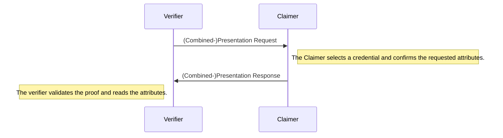

# Verification

During the verification the verifier request a set of attributes from the claimer. 
The claimer discloses his attributes and provides a proof.
the verifier can validate that the attributes are singed by a trusted attester using the proof.



The claimer needs a credential and the public key of the attester who signed the credential.
The verifier needs to trust the attester who signed the credential.

```ts
// The verifier request a presentation:
const {
    // local information used to verify the presentation later
    session: verifierSession,
    // the request which should be send to the claimer and contains the requested attributes
    message: presentationReq,
} = await GabiVerifier.requestPresentation({
    // specify which attributes should be disclosed
    requestedAttributes: ["age"],
    // Specifies whether or not the claimer needs to provide a non revocation proof.
    // A revocation proof adds some computational effort
    reqNonRevocationProof: true,
    // specifies the index of the oldest accumulator accepted.
    reqMinIndex: index,
})

// After the claimer has received the PresentationRequest he builds a Presentation:
const presentation = await claimer.buildPresentation({
    credential,
    presentationReq,
    attesterPubKey: attester.getPubKey(),
})

// The presentation is send over to the verifier who validates the proof and extracts the claim
const {
    // the contained claim, this value is undefined if the proof could not be validated.
    claim,
    // a boolean which indicates whether the presentation was valid.
    verified,
} = await GabiVerifier.verifyPresentation({
    // the presentation which was send over by the claimer
    presentation,
    verifierSession,
    // the public key which was used by the attester to sign the credential
    attesterPubKey: attester.getPubKey(),
})
```
